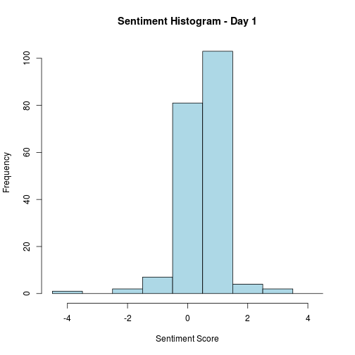
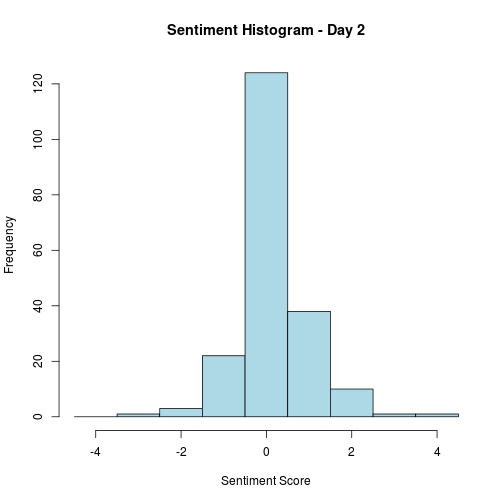
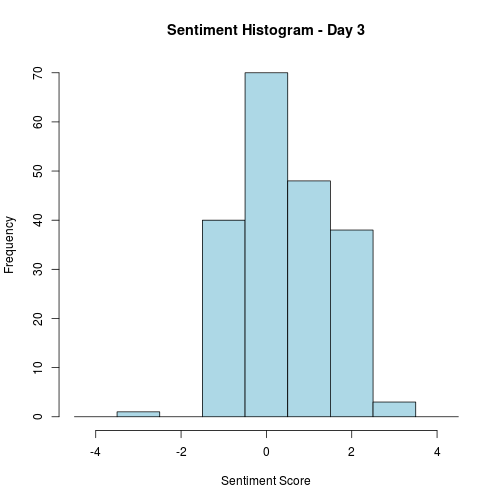
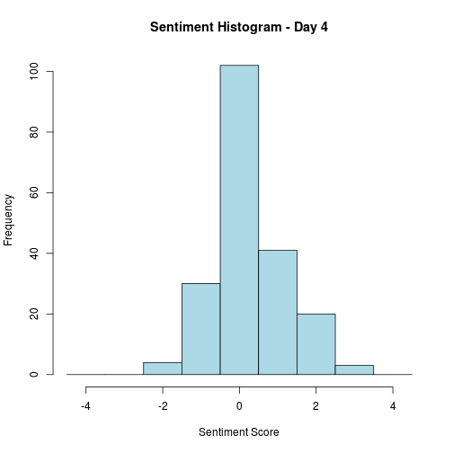
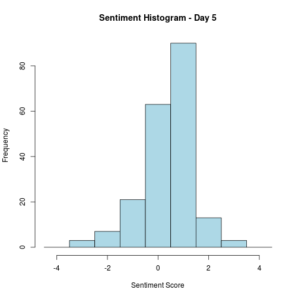
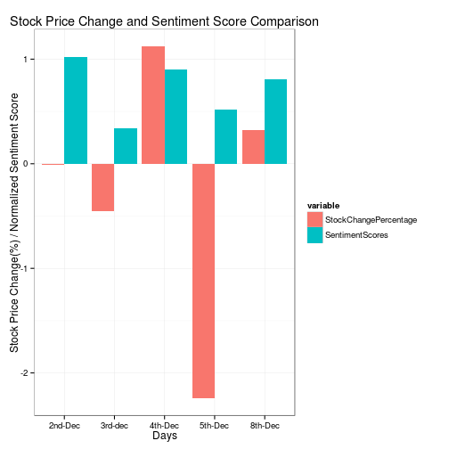

Stock Prediction of Google Using Twitter Sentiment Analysis
========================================================
**Sonali Changkakoti** 

**IT 497, Group Assignment # 2**

A sentiment analysis was conducted using tweets about Google. Total number of tweets collected per day was 200.

The sentiment histograms for each day are given below. The sentiment scores are spread over a range of [-4, 4]. The histograms show that day 1, 3 and 5 experienced highly positive sentiments whereas the other 2 days had slightly positive sentiments in tweets:

 

 

 

 

 

A graph comparing the sentiments for the 5 days to the actual stock price changes is given below. The bars with pink represent the percentage of change of stock price and bars with blue color are of sentiment score.

 

Twitter data were used to study the sentiments of the people. It was observed that the emotions and moods of individuals affect their decision making process, thus, leading to a direct correlation between public sentiments and market sentiments.  Sentiments were calculated from 200 tweets for each day of Google for five business days from December 2, 2014 to December 8, 2014.

Sometimes a sentiment cannot predict the general stock movement. The sentiments could be positive and higher, but the change in the stock price could be slightly negative. There were a few exceptions in the observation.  There was a drop of the stock prices on 2nd and 3rd December perhaps due to the rumor of rival Apple, who might drop Google as the main search engine for Safari. The partnership may end early next year and it is reported that Apple will either go with another search engine or perhaps launch its own.

The fall of stock price again on 5th December was mainly due to downgrading of Google to Neutral by Merrill Lynch. Merrill Lynch team cut Google price target to $580 from $600. The downgrade was based on the following reasons:  increased regulatory risk, particularly in the European Union; a strong Apple product cycle and search contract renewal uncertainty; competition from the likes of Facebook in ad networks and possibly in search; and reversal of U.S. online advertising market share gains from social media. This caused a large downward spike in Google stock even with highly positive public sentiment.

 

